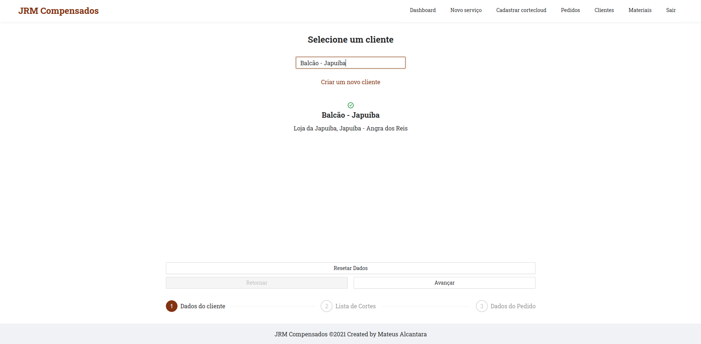
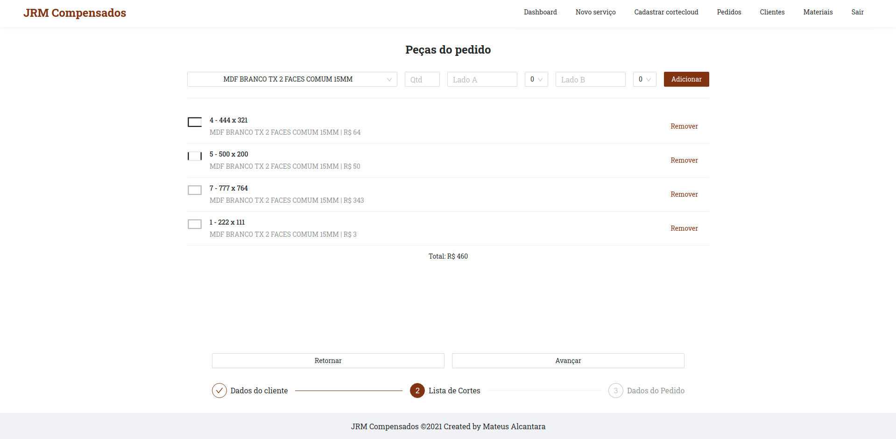
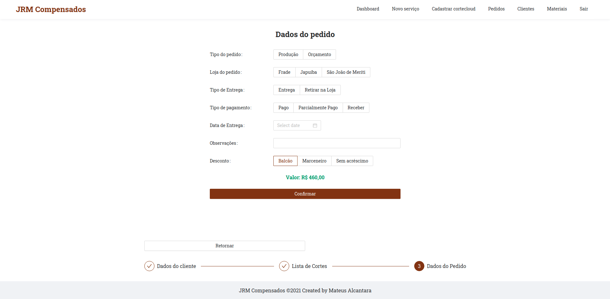

# JRM App v1

This was the first edition of the app used to manage our company sector.

Note: My source to study and create this project was [this repository by EliasGcf with GoBarber Project by Rocketseat](https://github.com/EliasGcf/gobarber).

## Backend

[API REST](https://github.com/mat-alcantara/jrm-api)

## Frontend

[WEB CLIENT](https://github.com/mat-alcantara/jrm-web)

---

Made by Mateus Alcantara 👋 &nbsp;[See my linkedin](https://www.linkedin.com/in/mat-alcantara/)
